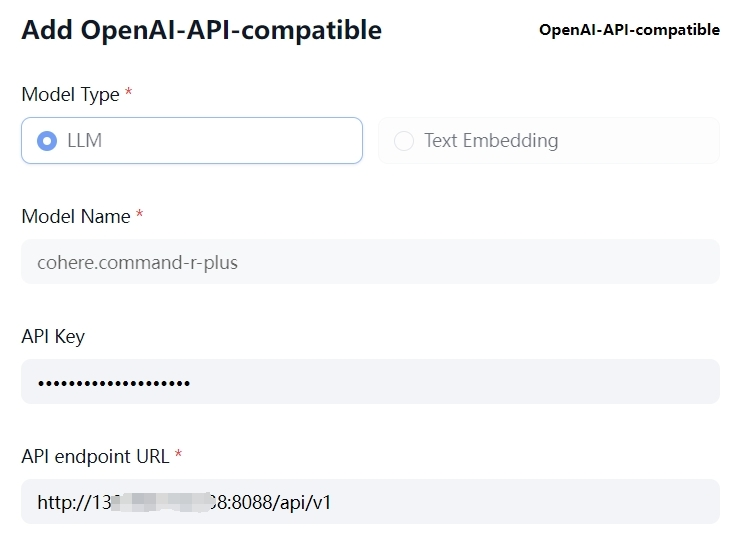
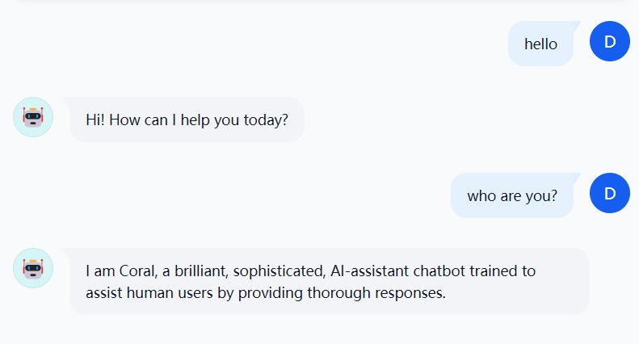

**Oracle Cloud Infrastructure (OCI) Generative AI Service** is a fully managed service that integrates these versatile language models into a variety of use cases.

Oracle has released SDK that makes it easy to call OCI Generative AI services. However, for many packaged projects, some code modification is required to integrate the OCI Generative AI services.

Due to the wide application of OpenAI services, its API interface format has been supported by the vast majority of AI applications. In order to speed up application integration, a project has been created to make OCI Generative AI services compatible with the OpenAI API.

With this project, you can quickly integrate any application that supports a custom OpenAI interface without modifying the application.

---

**Oracle 云基础设施 (OCI) 生成式 AI** 是一种完全托管的服务，可将这些多功能语言模型集成到各种用例中。

Oracle已经发布了SDK，可以方便地调用OCI生成式AI服务。但是对于很多已经包装好的项目，需要一些代码修改工作量，以集成OCI上的生成式AI服务。

由于OpenAI服务的广泛应用，其API接口格式已经被绝大多数AI应用所支持。为了能够加快应用集成，一个使OCI生成式AI服务兼容OpenAI API的项目被创建。

通过此项目，您可以在不修改应用的情况下，快速集成任何支持自定义OpenAI接口的应用程序。

*This is a project inspired by [aws-samples/bedrock-access-gateway](https://github.com/aws-samples/bedrock-access-gateway/tree/main)*

# Change log
- 20250407: Now support tool call for both cohere and llama in stream/non-stream mode.
- 20250221: Now support image input for multimodal model like `meta.llama-3.2-90b-vision-instruct`
- 20250121: Add `gunicorn` to support parallel threads, get a 9x speed up. Thanks to [@streamnsight](https://github.com/jin38324/OCI_GenAI_access_gateway/pull/4)
- 20241219: Add a parameter `EMBED_TRUNCATE` in `config.py`. This is a parameter that OpenAI does not have. The default setting `END` will truncate input that exceeds the maximum token length and keep the beginning part.
- 20241031: Now you can run this app in docker, simpler thanks to @streamnsight
- 20241031: Add MIT license
- 20241022: Support LLM service deployed through the AI ​​Quick Action of OCI Data Science; Optimize model configuration;
- 20240905: Support Instance principals auth. Thanks to [@munger1985](https://github.com/jin38324/OCI_GenAI_access_gateway/pull/2);
- 20240815: Add Dedicated AI Cluster support;
- 20240729: first commit;

# Quick Start


1. Clone this repository and [set prerequisites](#set-prerequisites);

2. Run this app:

    ## Option 1: Launch on host

   In directory `./app`

   run uvicorn:
    ```bash
    python app.py
    ```
    
    or use `gunicorn` to enable `parallel threads` (only support linux):
   
   ```bash
   gunicorn app:app --workers 16 --worker-class uvicorn.workers.UvicornWorker --timeout 600 --bind 0.0.0.0:8088
   ```

    ## Option 2: Launch in docker

    Make sure the `key_file` parameter in user's directory `~/.oci/config` is `~/.oci`, where config and private key located.

    ```bash
    docker build -t oci_genai_gateway .

    docker run -p 8088:8088 \
            -v ~/.oci:/root/.oci \
            -it oci_genai_gateway
			-n oci_genai_gateway
    ```

4. Config your application like this:


It's OK now!




# Set Prerequisites

## 1. Install python packages
`pip install -r requirements.txt`

## 2. Set authentication
Create access authentication for OCI. There are two ways to achieve this:
- Use API Key. This need a little effort, but easy to understand and can be used everywhere
- Use instance principal. This is easy to set but only available on OCI host machines.

**Option1: Use API Key**    

create config file on OCI console, follow this [SDK and CLI Configuration File](https://docs.oracle.com/en-us/iaas/Content/API/Concepts/sdkconfig.htm).

Set `config.py` file, point to your config location,like `OCI_CONFIG_FILE = "~/.oci/config"`.

**Option2: Use instance principal setting**

Set [OCI policy](https://docs.oracle.com/en-us/iaas/Content/Identity/policieshow/Policy_Basics.htm), define
```
allow dynamic-group <xxxx> to manage generative-ai-family in tenancy
```
xxxx is your dynamic-group that indicated your vm or other resources

in `config.py`, set `AUTH_TYPE=INSTANCE_PRINCIPAL`

## Other settings:

You can modify the `config.py` file to change default settings.
- `PORT`: service http port
- `RELOAD`: if True, the web service will reload if any file change in the project
- `DEBUG`: if True, more logs will displayed
- `DEFAULT_API_KEYS`: Authorize token for the API, default is `ocigenerativeai`
- `API_ROUTE_PREFIX`: API url PREDIX
- `AUTH_TYPE`: `API_KEY` or `INSTANCE_PRINCIPAL`
- `OCI_CONFIG_FILE`: OCI config file location, default is `~/.oci/config`
- `OCI_CONFIG_FILE_KEY`: multiple configs can be added in one config file, so you can use key to determain use which one
- `INFERENCE_ENDPOINT_TEMPLATE`: no need to modify, unless the OCI service changes


# Models

Generative AI is a rapidly evolving field, with new models being added and old models being retired.
So I abandoned hard-coding model information in the code and instead defined the model through `models.yaml`.

Don't worry, most of the models have been written well in the file, you just need to use them.

== You can change your `models.yaml` in your runtime if new models are avaliable. ==

You can define 4 types of models:
- **ondemand**: pre-trained chat model provided by OCI generative AI service, accessed through a unified API.
- **embedding**: pre-trained embedding model provided by OCI generative AI service, accessed through a unified API.
- **dedicated**: OCI Generative AI service’s proprietary model, the model to be accessed is determined by specifying the endpoint
- **datascience**: LLM service deployed through the [AI ​​Quick Action function of OCI Data Science](https://docs.oracle.com/en-us/iaas/data-science/using/ai-quick-actions.htm).
AI Quick Actions makes it easy for you to browse foundation models, and deploy, fine-tune, and evaluate them inside Data Science notebooks.
The model to be accessed is determined by specifying the endpoint, and endpoint should be end with `/predict`. 
When create datascience deployment `Inference mode`should be `/v1/chat/completions`.`Inference container` should be `VLLM`.

Model information parameters:
- `region`: OCI services can be provided by multiple regions, so you can configure the region to be called
- `compartment_id`: Required, this parameter determines the compartment where the service is initiated, which is basically related to cost and permission management;
- `name`: is a custom name, a legal string is fine
- `model_id`: is the [standard model ID](https://docs.oracle.com/en-us/iaas/Content/generative-ai/pretrained-models.htm)
- `endpoint`: Call endpoint, which can be viewed through the OCI console


# Test the application

## Set base_url

```python
from openai import OpenAI

client = OpenAI(
    api_key = "ocigenerativeai",
    base_url = "http://xxx.xxx.xxx.xxx:8088/v1/",
    )
models = client.models.list()
for model in models:
    print(model.id)
```

More example please check the notebook [Endpoint test.ipynb]("Endpoint test.ipynb")